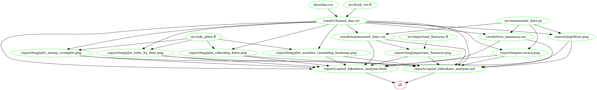

# Capital Bikeshare Ridership Prediction

<sup>Mike Yuan ([Mikeymice](https://github.com/Mikeymice)) and Evan Yathon ([EvanYathon](https://github.com/EvanYathon)) </sup>

> Data Citation:
>
> [1] Fanaee-T, Hadi, and Gama, Joao, "Event labeling combining ensemble detectors and background knowledge", Progress in Artificial Intelligence (2013): pp. 1-15, Springer Berlin Heidelberg, doi:10.1007/s13748-013-0040-3.

Bike sharing systems are becoming one of popular transportation measures in the urban areas. The bike share systems usually provide customers with durable bikes and stations for rental and parking. The bikes can be unlocked from any station and returned to any station at any time.

We are interested in answering the question.

> **What are the top three predictors of rental bike ridership?**

To answer this question, we used data originally sourced from [Capital Bikeshare](https://www.capitalbikeshare.com) in metro DC. We performed supervised machine learning using decision tree classification.  Valid features such as temperature, weather and day of the week were included.  In order to simplify the potential ridership outcomes, the ridership was broken into different chunks;  `Low`, `Medium` and `High` ridership categories.  To find the bounds of the categories, we used quantiles to evenly split the number of rentals per day in our data. Data cleaning and wrangling were performed.

To optimize the accuracy of the decision tree, we performed cross validation on the cleaned data to define the ideal maximum height for the tree.  The decision tree was trained using this optimal height. By visualizing the tree and utilizing scikit-learn's `feature_importances` function, we determined which of the features are the strong predictors of daily bicycle ridership.

[Link to report.](report/capital_bikeshare_analysis.md)

## Data Attributes

This analysis was performed on the [Bike Sharing Dataset](https://archive.ics.uci.edu/ml/datasets/Bike+Sharing+Dataset) provided by the UCI Machine Learning Repository

Both hour.csv and day.csv had the following fields, except hr which was not available in day.csv

| Variable   | Description                                                                                                                                                                                                                                                                                                   |
| ---------- | ------------------------------------------------------------------------------------------------------------------------------------------------------------------------------------------------------------------------------------------------------------------------------------------------------------- |
| instant    | record index                                                                                                                                                                                                                                                                                                  |
| dteday     | date                                                                                                                                                                                                                                                                                                          |
| season     | season (1:springer, 2:summer, 3:fall, 4:winter)                                                                                                                                                                                                                                                               |
| yr         | year (0: 2011, 1:2012)                                                                                                                                                                                                                                                                                        |
| mnth       | month ( 1 to 12)                                                                                                                                                                                                                                                                                              |
| hr         | hour (0 to 23)                                                                                                                                                                                                                                                                                                |
| holiday    | weather day is holiday or not                                                                                                                                                                                                                                                                                 |
| weekday    | day of the week                                                                                                                                                                                                                                                                                               |
| workingday | if day is neither weekend nor holiday is 1, otherwise is 0.                                                                                                                                                                                                                                                   |
| weathersit | <ol>  <li>Clear, Few clouds, Partly cloudy, Partly cloudy</li><li>Mist + Cloudy, Mist + Broken clouds, Mist + Few clouds, Mist</li> <li>Light Snow, Light Rain + Thunderstorm + Scattered clouds, Light Rain + Scattered clouds</li> <li>Heavy Rain + Ice Pallets + Thunderstorm + Mist, Snow + Fog</li></ol> |
| temp       | Normalized temperature in Celsius. The values are derived via <br> `(t-t_min)/(t_max-t_min), t_min=-8, t_max=+39 (only in hourly scale)`                                                                                                                                                                      |
| atemp      | Normalized feeling temperature in Celsius. The values are derived via <br> `(t-t_min)/(t_max-t_min), t_min=-16, t_max=+50 (only in hourly scale)`                                                                                                                                                             |
| hum        | Normalized humidity. The values are divided to 100 (max)                                                                                                                                                                                                                                                      |
| windspeed  | Normalized wind speed. The values are divided to 67 (max)                                                                                                                                                                                                                                                     |
| casual     | count of casual users                                                                                                                                                                                                                                                                                         |
| registered | count of registered users                                                                                                                                                                                                                                                                                     |
| cnt        | count of total rental bikes including both casual and registered                                                                                                                                                                                                                                              |

## Usage

1.  Clone this repo, and using the command line navigate to the root of this project.
2.  Run the following command to produce the report:

    ```sh
    make all
    ```

    or on your command shell

    ```sh
    bash run_all.sh
    ```

    Run the following command to clean previous result

    ```sh
    make clean
    ```


3.  The report is generated under the  `report/` directory

### Docker

To run this analysis using Docker, clone/download this repository, use the command line to navigate to the root of this project on your computer, and then type the following (filling in PATH_ON_YOUR_COMPUTER with the absolute path to the root of this project on your computer).

To pull the docker image

```sh
docker pull yuanmike/capital_bikeshare_analysis
```

To generate the report

```sh
docker run --rm -v PATH_ON_YOUR_COMPUTER:/home/capital_bikeshare_analysis yuanmike/capital_bikeshare_analysis make -C 'home/capital_bikeshare_analysis' all
```

To clean the results

```sh
docker run --rm -v PATH_ON_YOUR_COMPUTER:/home/capital_bikeshare_analysis yuanmike/capital_bikeshare_analysis make -C 'home/capital_bikeshare_analysis' clean
```

## Workflow

Our workflow was the following:

1.  Perform data cleaning and feature engineering
2.  Perform Machine Learning with Decision Tree and output feature importances
3.  Use `ggplot2` to produce EDA graphs
4.  Construct report with results from EDA and the Decision Tree model

In order to reproduce our findings, both `Makefile` and `run_all.sh` took the same work flow to generate the report. The scripts would run `load_csv.R` to generate cleaned data. `summarise_data.py` would perform data analysis and produced result data. `eda_plot.R` would use cleaned data to generate plots and `importance_features.R` would also plot the feature importances from the result. Finally, with `knitr`, `capital_bikeshare_analysis.Rmd` would generate our final report in the `markdown` format.

Here is a dependency graph of our outputs, scripts and inputs used in `Makefile`.


## V2.0 Dependencies

-   ### R and R libraries (R Version 3.5.1)
    -   `tidyverse` v1.2.1
    -   `lubridate` v1.7.4
    -   `ggplot2` v3.0.0
    -   `rmarkdown` v1.10
    -   `knitr` v1.20
    -   `pracma` v2.1.8
-   ### Python (Python Version 3.6.5)
    -   `pandas` v0.23.0
    -   `numpy` v1.14.3
    -   `sklearn` v0.19.1
    -   `graphviz` v0.10.1
    -   `pydotplus` v2.0.2
    -   `seaborn` v0.9.0
    -   `Ipython` v6.4.0
    -   `matplotlib` v2.2.2
    -   `tqdm` v4.28.1
