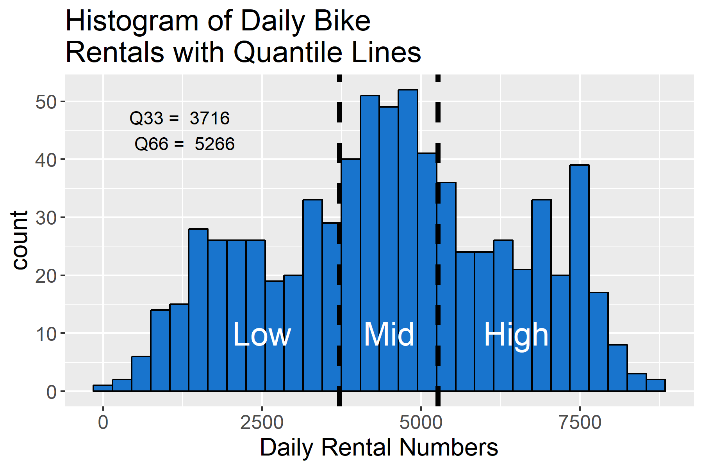
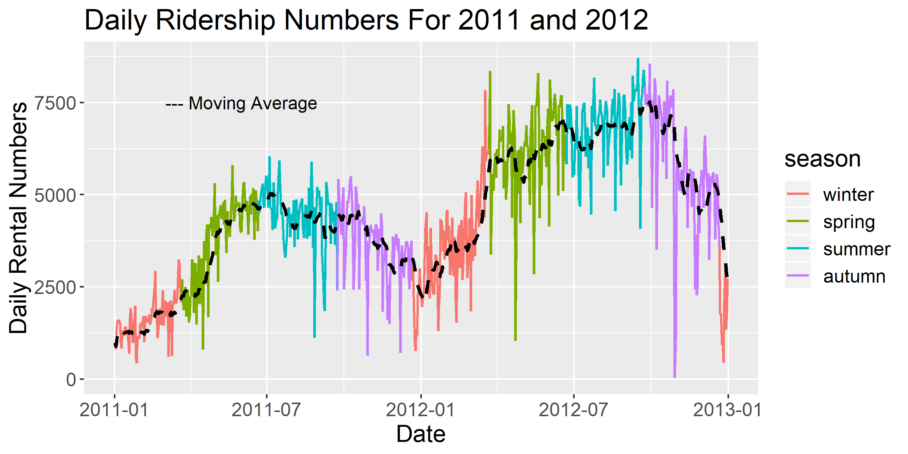
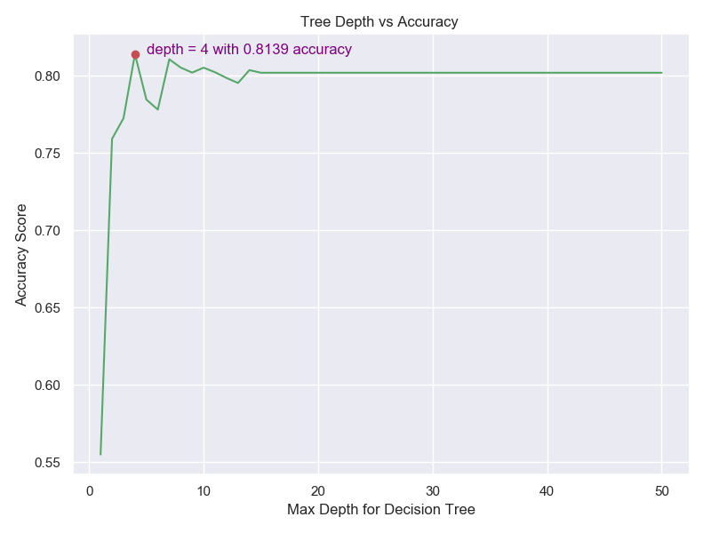
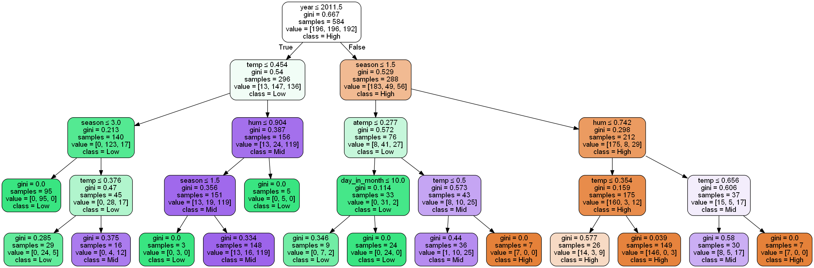
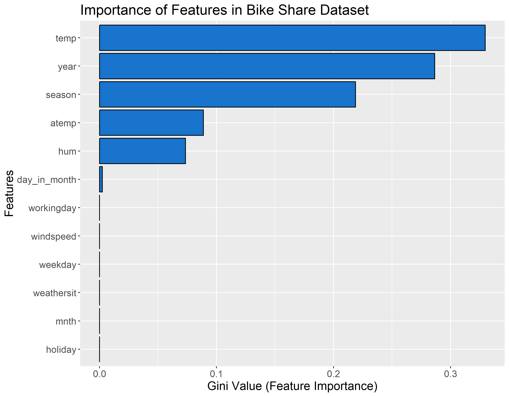

```{r setup, include=FALSE}
knitr::opts_chunk$set(echo = TRUE)
knitr::opts_knit$set(root.dir = here::here())
library(tidyverse)
library(knitr)
```

Bike sharing systems are increasingly popular in urban centres as an easy and effective way for people to get from one location to another; in the United States, [bike ridership grew](https://nacto.org/bike-share-statistics-2016/) from 320,000 yearly trips in 2010 to 28 million in 2016 <sup>1</sup>.  Weather, temperature and season are some motivators behind the choice to use a bike sharing service for commuting.  Knowing the factors that influence whether a person chooses to rent a bike on a particular day is important to forecast usage and understand drivers behind daily bike rentals.  This is why we chose to investigate the top three predictors of rental bike ridership using the [Capital Bike Share Dataset](https://archive.ics.uci.edu/ml/datasets/bike+sharing+dataset)<sup>2</sup>.

### Exploratory Data Analysis

> What are the top three predictors of rental bike ridership?

To answer this question, we decided to use a decision tree to predict daily ridership, and extract the top three predictors from the fit model.  Our approach required the ridership to be split into three categories as shown below.

```{r fig.cap = "Figure 1. Histogram of daily bike ridership, separated into thirds.", echo = FALSE}

```


Figure 1 gives an idea of the daily ridership count from the Capital Bikeshare system in Washington, D.C. over the period of 2011 and 2012.  Our decision was to split daily ridership into equal thirds so that the decision tree would have an equal split of target categories to learn from.  The resulting categories are `Low`, `Mid` and `High` ridership numbers on a daily basis.

There are many different features in the dataset, including temperature, humidity and weather conditions.

```{r fig.cap = "Figure 2. Daily Ridership over the course of two years, coloured by season.  Black dotted line is a 15 point moving average acting as a smoother to observe trends with less noise.", echo = FALSE}

```


As seen above in figure 2, there is a cyclical trend in the ridership numbers, with decrease in ridership happening in late autumn and winter.  2012 also seems to have significantly higher ridership numbers than 2011.  The figures suggested that these features might be have been some of the predictors that we were looking for - it was interesting to compare the EDA results to those of the decision tree.

### Decision Tree Analysis and Decision

To identify the important predictors, we decide to use `DecisionTreeClassifier` to build the model and utilize the `feature_importances_` to identify the importances of the features. To optimize our tree performance, we perform cross-validation on the training set to identify the ideal `max_depth`. The result of cross-validation suggested that the ideal tree depth is `4` with the accuracy of `0.8139` as shown below.

```{r fig.cap = "Figure 3. Accuracy Score with various `max_depth` values during Cross validation", echo = FALSE}

```


The final tree model is fitted to the training set and achieve `0.7415` accuracy on our test set.

```{r fig.cap = "Figure 4. Visualization of the final fitted decision tree.", echo = FALSE}

```


Figure 4 shows the classification steps undertaken by the model to split data into final ridership categories.  Green nodes are classified as `Low` ridership, purple are `Mid` level ridership and orange are `High` ridership.  The intensity of the colour represents purity at each location.  The stump is split immediately on the year feature, with more `Low` and `Mid` ridership belonging to 2011 and a higher proportion of high ridership belonging to 2012.  This agrees with what we've seen and guessed from figure 2, but what about season?  It would be arduous to examine the entire tree and all decision splits.

```{r fig.cap = "Figure 5. Feature importance rated by Gini Value.", echo = FALSE}

```


Figure 5 holds the answer to our initial question; it appears that temperature, year and season were the top three predictors for this dataset.  Other features such as `atemp`, which is 'feels like' temperature, were also somewhat important but didn't hold as much weight as the top three.

### Critique and Future Work

Figure 1 has a large assumption that contaminates the rest of the data analysis; the values on which we split ridership into three categories.  If we chose to instead split on different values the decision tree would likely return different results than the ones we finished with.

Another issue that is likely influencing our results is the year variable.  As seen in figure 2, the ridership numbers appear to substantially increase in 2012 when compared with 2011.  Therefore when we are splitting ridership, 2012 is taking most of the high ridership values as seen in figure 3.  It might be useful to use a different target such as a ratio of available bikes to riders per day in order to accomodate for bicycle network expansions.  Another way to examine it would be to split the dataset into two years and then perform the same analysis on both and compare feature importance.

As this dataset has been available for almost five years there have been many studies performed.  One such [study](https://www.kaggle.com/antgoldbloom/random-forest-benchmark/output)<sup>3</sup> attempts to identify feature importance, albeit with a random forest machine learning algorithm.  The study was performed on the hourly dataset, and as such predicted hour to be the top contributor.  But it's second and third best predictors  were `workingday` and `humidity` which are very different from our answers - it would be worth examining why our results are so different.

## References
1. [Nacto Bike Share Statistic 2016](https://nacto.org/bike-share-statistics-2016/)
2. [Capital Bike Share Dataset](https://archive.ics.uci.edu/ml/datasets/bike+sharing+dataset)
      - Used the `day.csv` dataset.
3. [Anthony Goldbloom's 'What drives demand for DC's bikes Kaggle page](https://www.kaggle.com/antgoldbloom/random-forest-benchmark/output)
